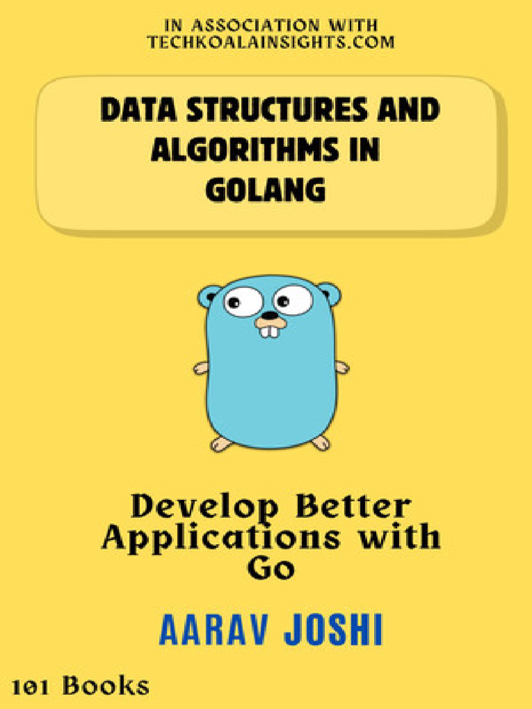

# Learn data structures in golang 🚀🚀🚀

## References

## Learning path:

- [x] Array

- [x] Hash Map

- [x] Stack

- [x] Queue

- [x] Linked List

- [ ] Tree (on progess)

- [ ] Heap (on progess)

- [ ] Graph (on progress)
