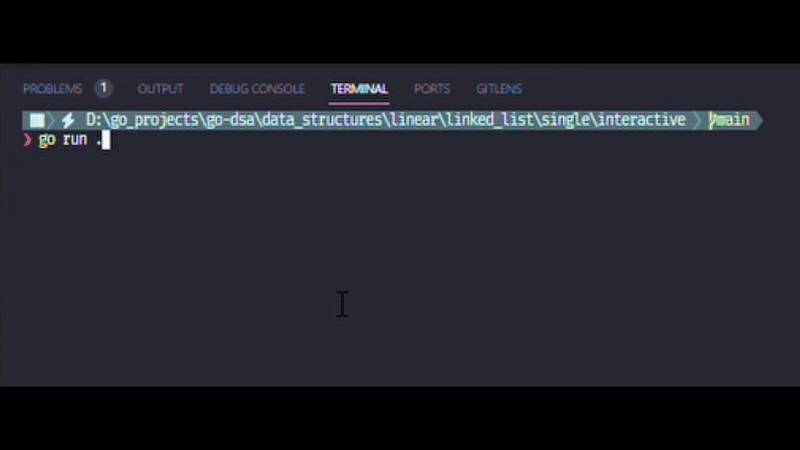

# Linked List CLI

A simple command-line tool for managing linked lists.

## Demo

## Features

- Add elements to end of list
- Add elements to start of list
- Display list contents
- Reset list
- Interactive CLI interface
