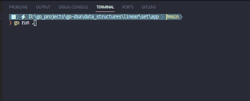

# Set CLI

A simple command-line tool for managing set.

# Demo

# Features

- Add elements to set
- Remove elements from set
- Display set contents
- Check set's size
- Check is set empty
- Reset set
